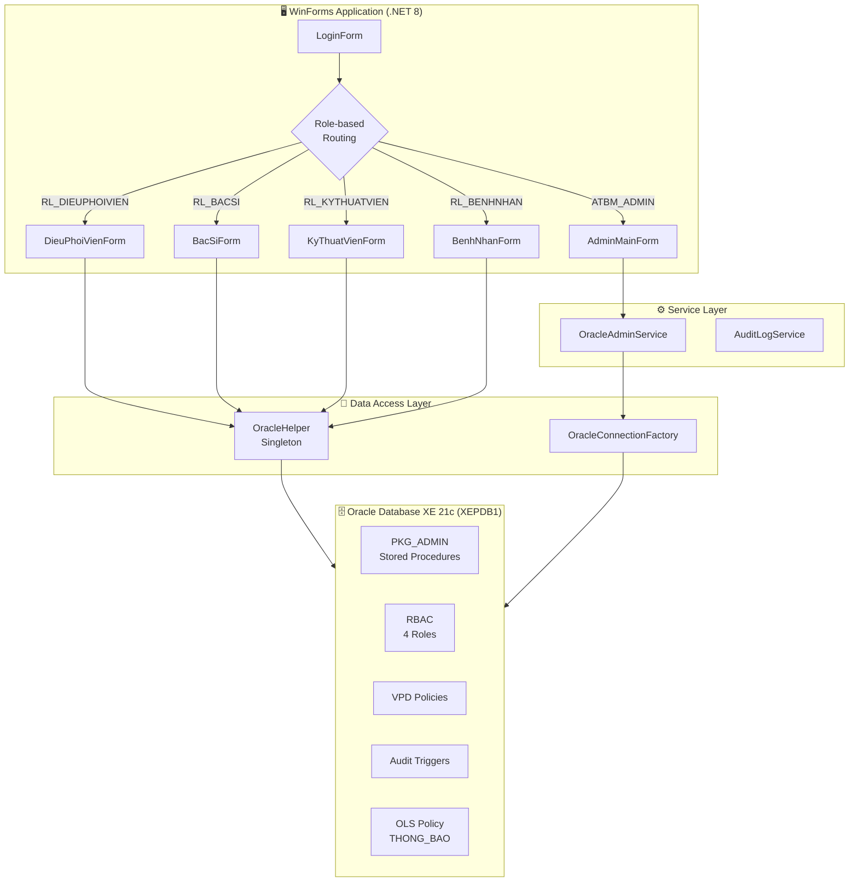
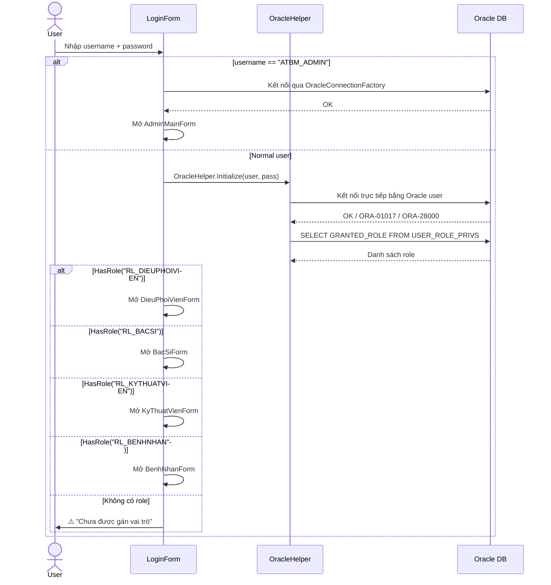
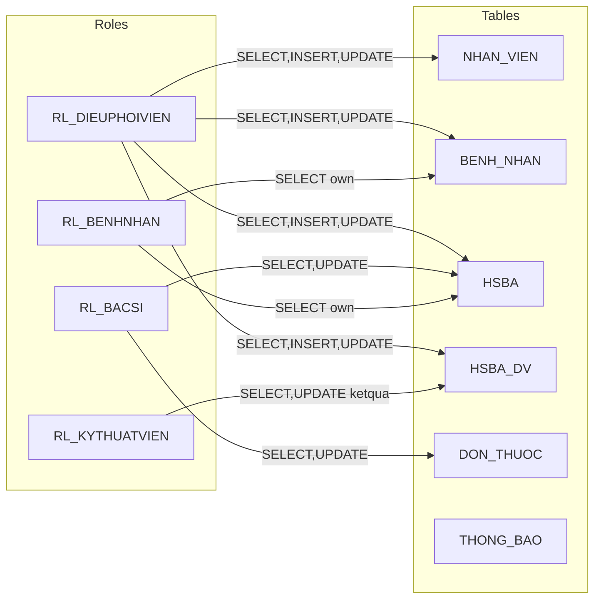

# 🏗️ Kiến trúc Hệ thống – Hospital Management

> Tài liệu mô tả kiến trúc tổng quan, luồng xác thực, cơ chế bảo mật và thiết kế ứng dụng.

---

## 1. Tổng quan kiến trúc

---

## 2. Phân tầng ứng dụng (Layered Architecture)

### 2.1 Presentation Layer – `Forms/`

| Form | Vai trò | Chức năng chính |
|------|---------|----------------|
| `LoginForm` | Entry point | Xác thực Oracle user, routing theo role |
| `AdminMainForm` | ATBM_ADMIN | Quản lý user/role, grant/revoke, dashboard DB |
| `DieuPhoiVienForm` | Điều phối viên | CRUD nhân viên, bệnh nhân, HSBA, dịch vụ |
| `BacSiForm` | Bác sĩ | Xem/cập nhật HSBA, kê đơn, thông báo khẩn |
| `KyThuatVienForm` | Kỹ thuật viên | Cập nhật kết quả xét nghiệm |
| `BenhNhanForm` | Bệnh nhân | Xem hồ sơ cá nhân, lịch sử khám |
| `AuditLogForm` | Support | Tra cứu audit log |
| `ThongBaoKhanForm` | Support | Quản lý thông báo khẩn (OLS) |

### 2.2 Service Layer – `Services/`

| Class | Trách nhiệm |
|-------|-------------|
| `OracleAdminService` | Proxy an toàn tới `PKG_ADMIN` (stored procedures). Validate input qua `IdentifierValidator` trước khi gọi PL/SQL. |
| `AuditLogService` | Truy vấn và phân tích audit log từ Oracle. |

### 2.3 Data Access Layer – `DataAccess/`

| Class | Pattern | Mô tả |
|-------|---------|-------|
| `OracleHelper` | **Singleton** | Quản lý connection, thực thi query/non-query/scalar. Kết nối trực tiếp bằng user Oracle để VPD nhận đúng `SESSION_USER`. |
| `OracleConnectionFactory` | **Factory** | Tạo `OracleConnection` từ `DbConnectionSettings`. Dùng bởi `OracleAdminService`. |

### 2.4 Models – `Models/`

| Model | Bảng Oracle | Thuộc tính chính |
|-------|------------|-----------------|
| `NhanVien` | `NHAN_VIEN` | MaNV, HoTen, Phai, NgaySinh, CMND, VaiTro, ChuyenKhoa |
| `BenhNhan` | `BENH_NHAN` | MaBN, TenBN, Phai, CCCD, DiaChi, TienSuBenh, DiUngThuoc |
| `Hsba` | `HSBA` | MaHsba, MaBN, Ngay, ChuanDoan, DieuTri, MaBS, KetLuan |
| `HsbaDv` | `HSBA_DV` | Mapping dịch vụ cho HSBA |
| `DonThuoc` | `DON_THUOC` | Đơn thuốc liên kết HSBA |
| `AuditLog` | Audit tables | Ghi vết thay đổi kết quả xét nghiệm |
| `DbConnectionSettings` | – | Cấu hình connection string Oracle |

### 2.5 Helpers – `Helpers/`

| Class | Chức năng |
|-------|----------|
| `UIHelper` | Design system: color palette (dark theme), fonts (Segoe UI), factory methods cho Button/TextBox/Label/DataGridView/TabControl. |
| `IdentifierValidator` | **Chống SQL Injection**: Normalize & validate tên user, role, object, privilege trước khi đưa vào dynamic SQL. |
| `AdminUiHelper` | Tiện ích UI riêng cho `AdminMainForm`. |

---

## 3. Luồng xác thực & phân quyền

### Điểm quan trọng

- **Không có application-level auth** – Xác thực 100% dựa trên Oracle user credentials
- **VPD hoạt động nhờ `SESSION_USER`** – Mỗi user kết nối trực tiếp, Oracle tự apply VPD policy
- **Logout = Dispose connection** – `OracleHelper.Instance?.Dispose()` khi đóng form chính

---

## 4. Kiến trúc bảo mật Oracle

### 4.1 RBAC – Role-Based Access Control

### 4.2 VPD – Virtual Private Database

| Policy | Áp dụng cho | Điều kiện lọc |
|--------|------------|--------------|
| `vpd_basic` | `NHAN_VIEN` (self-view) | DPV/BS chỉ thấy record của mình + nhân viên cùng khoa |
| `vpd_dpv_bs` | `BENH_NHAN`, `HSBA`, `HSBA_DV`, `DON_THUOC` | DPV: theo khoa quản lý. BS: theo bệnh nhân được phân công |

### 4.3 Audit

- **Đối tượng**: Bảng `HSBA_DV` (kết quả xét nghiệm)
- **Trigger**: Ghi lại mọi UPDATE trên cột `KETQUA`
- **Tra cứu**: Qua `AuditLogForm` / `AuditLogService`

### 4.4 OLS – Oracle Label Security

- **Bảng**: `THONG_BAO` (thông báo khẩn cấp)
- **Mức bảo mật**: Phân cấp label theo vai trò (ai được đọc thông báo nào)
- **UI**: `ThongBaoKhanForm`

---

## 5. Design System (UI)

Ứng dụng sử dụng dark theme nhất quán, được định nghĩa trong `UIHelper.cs`:

### Color Palette

| Token | Hex | Sử dụng |
|-------|-----|---------|
| `PrimaryBlue` | `#2962FF` | Nút chính, selected tab, selection |
| `PrimaryDark` | `#19192D` | Background chính |
| `SecondaryDark` | `#23233C` | Header, panel phụ |
| `CardBackground` | `#2D2D4B` | Card container |
| `AccentGreen` | `#00C896` | Trạng thái thành công |
| `AccentOrange` | `#FFA500` | Cảnh báo |
| `AccentRed` | `#FF5252` | Lỗi, nguy hiểm |
| `TextPrimary` | `#F0F0FF` | Text chính |
| `TextSecondary` | `#A0AAC8` | Text phụ, label |

### Typography

- **Title**: Segoe UI 22pt Bold
- **Subtitle**: Segoe UI 14pt
- **Heading**: Segoe UI Semibold 16pt Bold
- **Body/Label**: Segoe UI 11pt
- **Small**: Segoe UI 9pt

---

## 6. Quyết định kiến trúc (ADR)

### ADR-001: Xác thực trực tiếp qua Oracle User

**Status**: Accepted

**Context**: Hệ thống cần VPD policies hoạt động đúng dựa trên `SESSION_USER`.

**Decision**: Mỗi user ứng dụng là một Oracle user thực. Login form kết nối trực tiếp bằng credentials Oracle, không qua middleware hay application-level auth.

**Consequences**:
- ✅ VPD/RBAC/Audit hoạt động đúng ngữ cảnh Oracle
- ✅ Không cần implement auth layer riêng
- ⚠️ Cần tạo 100K+ Oracle user (cho 100K bệnh nhân)
- ⚠️ Mật khẩu đơn giản (`123`) – chỉ phù hợp cho demo

### ADR-002: Singleton Pattern cho OracleHelper

**Status**: Accepted

**Context**: Cần duy trì 1 kết nối Oracle duy nhất xuyên suốt phiên làm việc.

**Decision**: `OracleHelper` sử dụng Singleton pattern (`_instance`). Mỗi lần login tạo instance mới, dispose instance cũ.

**Consequences**:
- ✅ Đơn giản, dễ truy cập (`OracleHelper.Instance`)
- ✅ Connection reuse tốt
- ⚠️ Không thread-safe nếu mở rộng multi-threading

### ADR-003: Stored Procedures qua PKG_ADMIN

**Status**: Accepted

**Context**: Phân hệ 1 cần quản trị Oracle (CREATE/DROP USER, GRANT/REVOKE) an toàn.

**Decision**: Mọi thao tác admin đều qua package `PKG_ADMIN`. `OracleAdminService` chỉ gọi stored procedure, không build dynamic SQL phía application.

**Consequences**:
- ✅ Chống SQL injection hiệu quả
- ✅ Logic tập trung trong DB, dễ audit
- ⚠️ Cần deploy stored procedure trước khi chạy app
